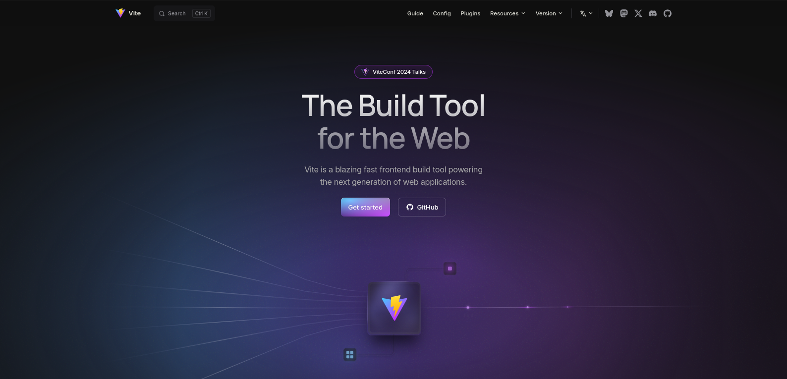

# My-Front-End-Integration-Learning-Journey

As a backend developer, I’ve struggled with front-end integration, especially responsive design. I often worked on front-end logic but avoided UI. To overcome this, I’m recreating website landing pages to improve my skills and become confident in building full-stack projects, including UIs.

### " Our Brain Only Learn Throw Challenges , Not always Reading Books or Watching Youtubes Videos

## The level i want to reach

## My Day 1 Level

